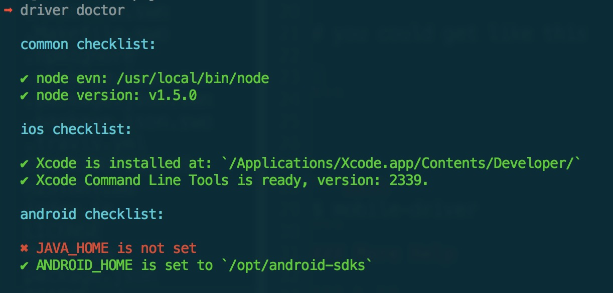

mobile-driver
=============

> Automation driver for mobile.

## Installment

```bash
$ npm i mobile-driver -g
```

## Quick Start

### Start server

```shell
# normal usage
$ driver server

# set a port
$ driver server -p 3456

# run in background
$ driver server -p 3456 &

# send signal to server process
$ dirver -s restart
```

### Run Test

```shell
# run test in current cwd
$ driver run

# run test in a pointed directry and set a framework
$ driver run -d ./test -f mocha

# run with a auto run server?
$ driver run --server --verbose
```
### Environment Doctor

```shell
$ driver doctor
```
You will get message like this.



### More Help

```shell
$ driver -h

# helper for server
$ driver server -h

# helper for how to run test
$ driver run -h

# helper for environment doctor
$ driver doctor -h
```
That's all, enjoy it!

## License

[MIT](LICENSE)

Copyright (c) 2014 xdf
